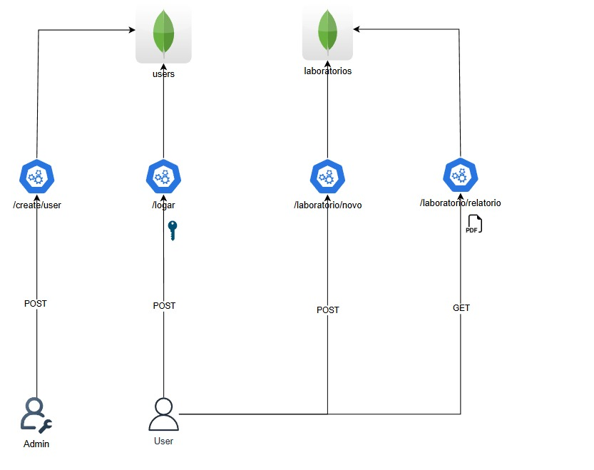

# 🏫 Sistema de Gerenciamento de Salas


## 📋 Índice

- [Sobre o Projeto](#-sobre-o-projeto)
- [Tecnologias Utilizadas](#-tecnologias-utilizadas)
- [Funcionalidades](#-funcionalidades)
- [Arquitetura](#-arquitetura)
- [Instalação e Uso](#-instalação-e-uso)
- [Rotas da API](#-rotas-da-api)
- [Testes](#-testes)
- [Link da API (render)](#-link-da-api-render)

---

## 📖 Sobre o Projeto

O projeto consiste em uma API RESTful para o gerenciamento de salas. A aplicação permite que usuários realizem login e cadastrem laboratórios com informações como nome, descrição, capacidade e foto. Também é possível gerar um relatório em PDF contendo a lista de laboratórios cadastrados. A API está protegida por um middleware que restringe o acesso apenas em dias úteis.

---

## 🛠 Tecnologias Utilizadas

- Node.js
- Express
- MongoDB
- Mongoose
- JWT (Json Web Token)
- bcrypt
- multer
- PDFKit
- supertest

---

## 🚀 Funcionalidades

- Autenticação de usuários com JWT.
- Cadastro de laboratórios.
- Geração de relatório em PDF com lista de laboratórios.
- Middleware que restringe acesso nos finais de semana.
- Testes automatizados.
- Armazenamento de dados no MongoDB.

---

## 🏗 Arquitetura



## 📦 Instalação e Uso

### Requisitos

- Node.js
- MongoDB

### Passos para rodar o projeto localmente

1. Clone o repositório:
   ```bash
   git clone https://github.com/IaraFV/web2-n2.git
   cd web2-n2
   ```

2. Instale as dependências:
   ```bash
   npm install
   ```

3. Crie um arquivo `.env` na raiz do projeto com as seguintes variáveis:
   ```env
   PORT=5000
   MONGODB_URI=sua_url_mongodb
   JWT_SECRET=sua_chave_secreta_jwt
   ```

4. Inicie o servidor:
   ```bash
   api/server.js
   ```

---

## 🔗 Rotas da API

### **Autenticação**

**POST** `/logar`  
- **Descrição:** Rota para autenticação de usuário.
- **Body:**  
  ```json
  {
    "email": "usuario@example.com",
    "senha": "suaSenha"
  }
  ```

---

### **Usuários**

**POST** `/create/user`  
- **Descrição:** Rota para criar um novo usuário.
- **Body:**  
  ```json
  {
    "nome": "Nome do Usuário",
    "email": "usuario@example.com",
    "senha": "suaSenha"
  }
  ```

---

### **Laboratórios**

**POST** `/laboratorio/novo`  
- **Descrição:** Rota para cadastrar um novo laboratório.  
- **Body (form-data):**  
  - `nome` (string)
  - `descricao` (string)
  - `capacidade` (number)
  - `foto` (file)

---

**GET** `/laboratorio/relatorio`  
- **Descrição:** Gera um arquivo PDF contendo a lista de laboratórios cadastrados, incluindo as fotos.

---

## 🧪 Testes

A API possui testes automatizados utilizando **Supertest** para validar as principais funcionalidades, como login, cadastro de usuários e gerenciamento de laboratórios. Os testes garantem que a API responde conforme esperado, identificando possíveis falhas.

### 📂 Arquivos de Teste

- `tests/auth.test.js` - Testes relacionados à autenticação de usuários.
- `tests/user.test.js` - Testes relacionados ao cadastro e manipulação de usuários.
- `tests/laboratorio.test.js` - Testes relacionados a rota de criar e gerar relatório de laboratórios.


---

## 🌐 Link da API (render)

**https://web2-n2.onrender.com**
